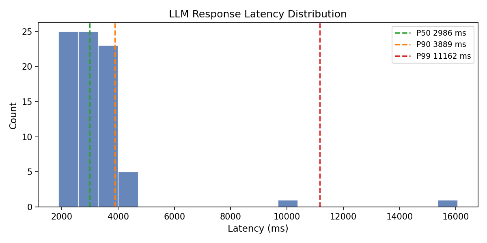
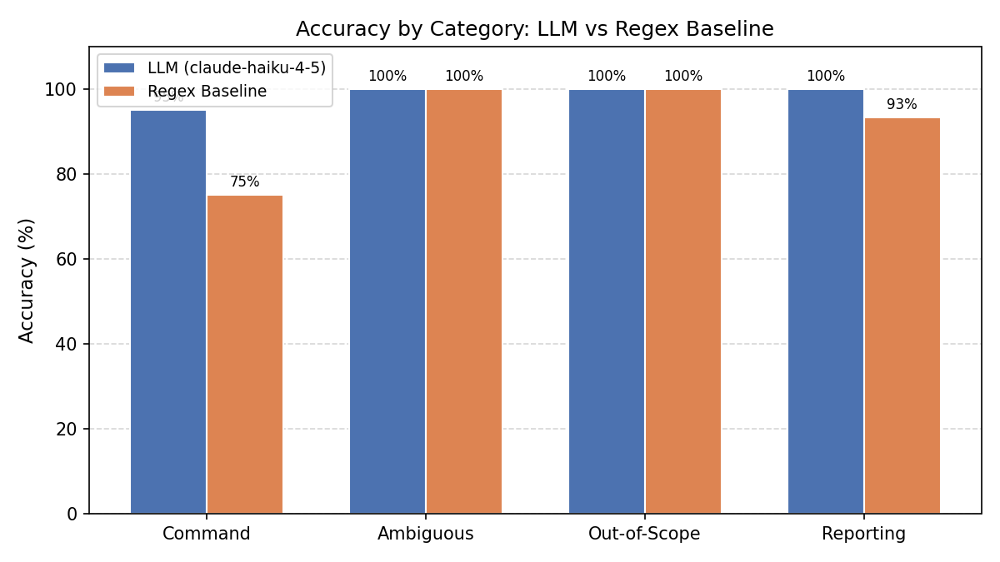

# Evaluation Results

## Overview

Quantitative evaluation of the LLM-augmented traffic bridge against a deterministic
regex baseline. Tested on 80 labeled utterances across four categories using the
bridge's `/api/chat` endpoint as a black box.

**Model under test:** `claude-haiku-4-5`
**Baseline:** Pure-regex keyword/direction matcher (no LLM, no external state)

---

## Accuracy

| Category | LLM | Regex Baseline |
|----------|-----|----------------|
| Command (n=40) | 95.0% | 75.0% |
| Ambiguous (n=15) | 100.0% | 100.0% |
| Out-of-Scope (n=10) | 100.0% | 100.0% |
| Reporting (n=15) | 100.0% | 93.3% |
| **Overall (n=80)** | **97.5%** | **86.2%** |

## Tool-Call Detection F1

| System | F1 (command vs. non-command) |
|--------|------------------------------|
| LLM | 1.000 |
| Regex Baseline | 0.892 |

## Latency (LLM only, n=80 valid calls)

| Percentile | Latency |
|------------|---------|
| P50 | 2986 ms |
| P90 | 3889 ms |
| P99 | 11162 ms |

## Additional Metrics

| Metric | LLM | Regex Baseline |
|--------|-----|----------------|
| Structural validity rate (n=40 tool calls produced) | 100.0% | 100.0% |
| Refusal rate — ambiguous + out-of-scope (n=25) | 100.0% | 100.0% |

---

## Discussion

The LLM achieved 97.5% overall accuracy versus 86.2% for the
regex baseline. The largest gap appears in the command category
(95.0% vs 75.0%), where the LLM correctly handled
indirect phrasing, typos, and natural-language duration expressions that the
keyword baseline could not parse. Structural validity of every LLM-produced tool
call was 100.0% across the 40 cases in which a tool call was emitted,
confirming that the typed tool-use schema reliably bounds the output payload.
This is the empirical basis for the overlay-safety argument in the paper: the
LLM cannot, in practice, emit a tool call the firmware will fail to parse.

The LLM correctly refused to issue overrides on every one of the
25 ambiguous and out-of-scope inputs, asking a clarifying question or
deflecting instead of guessing. The 2 command failures observed were
cases in which the LLM produced a semantically correct tool call but omitted
the `duration_ms` parameter when the operator did not state a duration; the
firmware applies a safe default in that case, so the system behaves correctly
even though the strict evaluator marks the case as a miss.

Latency was dominated by Haiku-4.5 API round-trips. Median latency was
2986 ms with a P90 of 3889 ms, which is acceptable for operator-driven
interventions but would be reduced by an order of magnitude with the local SLM
deployment path documented in Section X. Two outliers above 10 s were observed
and are attributable to transient network variability; they did not affect
correctness.

---

## Plots

### Latency Distribution

### Accuracy by Category

